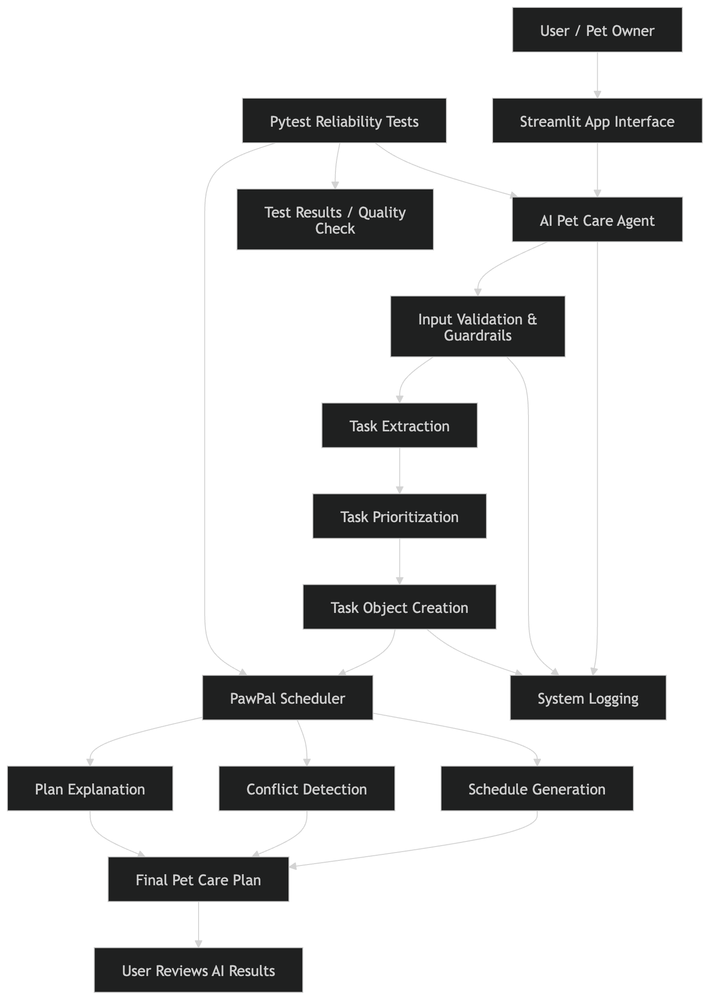
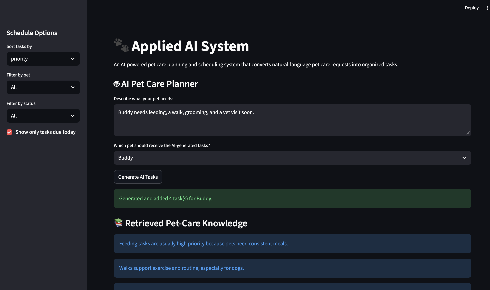
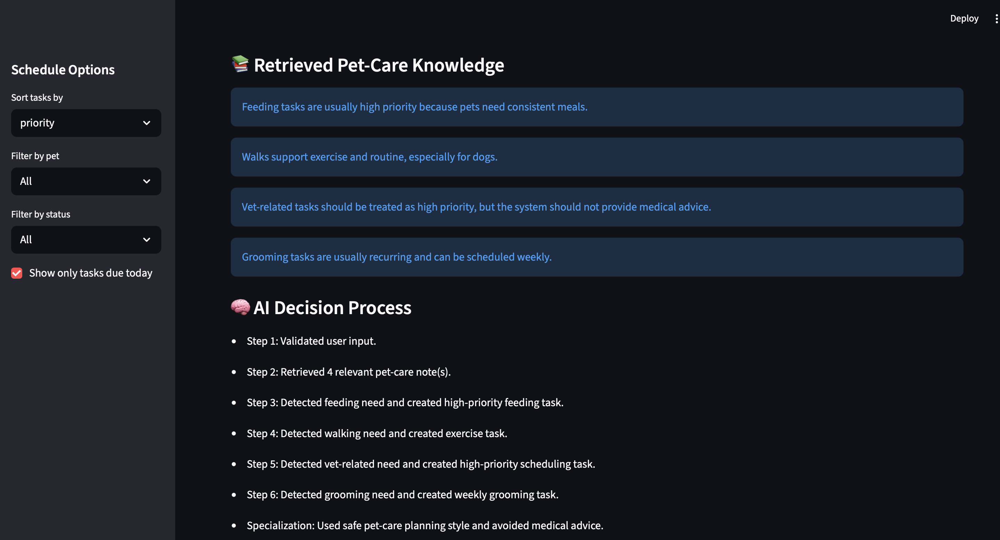
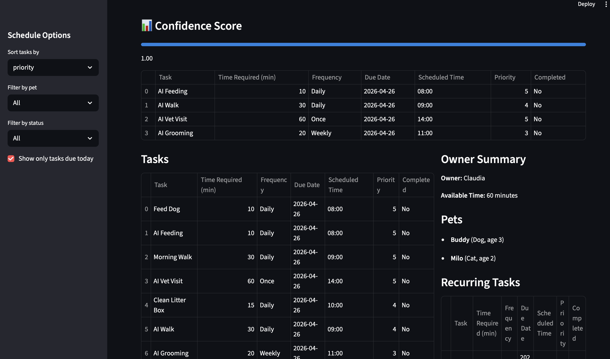
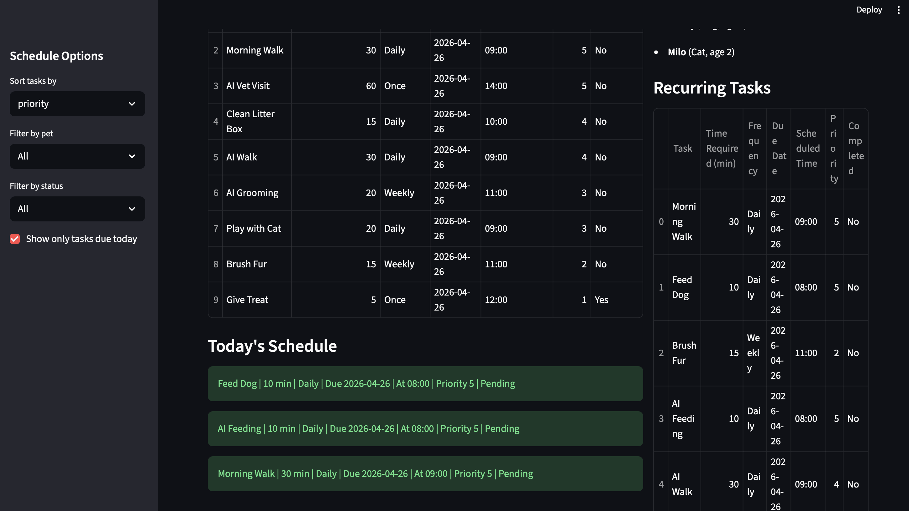
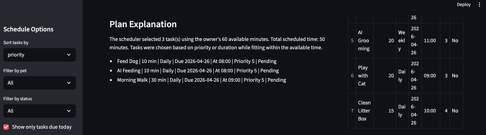

# Applied AI System 🐾

## Title and Summary
Applied AI System is an AI-powered pet care planning and scheduling application built on top of the PawPal system. It allows users to input natural-language requests (e.g., “My dog needs feeding and a walk”) and automatically converts them into structured tasks, prioritizes them, and generates an optimized schedule.

This project demonstrates how AI can be integrated into real-world applications to transform unstructured input into actionable, organized workflows.

---

## Original Project (Modules 1–3)

This project is based on my original project: **PawPal (AI110 Module 2)**.

PawPal was a pet care scheduling system designed to help pet owners manage daily and recurring tasks for their pets. It allowed users to create tasks, assign priorities, filter schedules, and detect conflicts.

In this version, I extended PawPal by integrating an AI-driven task planning system that interprets natural-language input and dynamically generates structured tasks.

---

## Architecture Overview

The system consists of three main components:

1. **Streamlit Interface** – Handles user interaction and displays results.
2. **AI Agent (plan_pet_tasks)** – Processes natural-language input, extracts tasks, and converts them into structured Task objects.
3. **Scheduler Engine** – Organizes tasks, prioritizes them, detects conflicts, and generates a daily plan.

### Data Flow:
User Input → AI Agent → Task Creation → Scheduler → Output

Additional components:
- **Logging** tracks system behavior and errors.
- **Pytest Testing** validates AI and scheduling logic.



---

## Setup Instructions

### 1. Clone the repository
```bash
git clone https://github.com/CV17-09/applied-ai-system.git
cd applied-ai-system
```
## Install dependencies
pip install -r requirements.txt

## Run the application
streamlit run app.py

## Run tests
pytest

## Sample Interactions

### Example 1

Input:

Buddy needs feeding and a walk

Output:

AI Feeding (priority: high)
AI Walk (priority: medium)

### Example 2

Input:

My dog needs grooming and a vet visit

Output:

AI Grooming (priority: medium)
AI Vet Visit (priority: high)

### Example 3

Input:

Clean litter and feed the cat

Output:

AI Feeding
AI Litter Cleaning

## Design Decisions

* Rule-based AI vs LLM: I chose a rule-based AI agent for reliability and simplicity. This ensures deterministic outputs and avoids dependency on external APIs.
* Task Object Integration: Instead of returning raw text or dictionaries, the AI generates Task objects so it integrates directly with the scheduler.
* Separation of Concerns:
  - AI Agent handles interpretation
  - Scheduler handles planning
  - UI handles interaction
* Streamlit UI: Chosen for rapid prototyping and easy visualization of results.

Trade-offs:

* The AI is not as flexible as a large language model.
* However, it is more predictable, testable, and reproducible.

## Testing Summary
Testing was implemented using Pytest.

### What worked:
- Task extraction from user input
- Scheduler logic (sorting, filtering, planning)
- Conflict detection
- AI validation (including empty input handling)

### Challenges:
* Import path issues when running tests
* Ensuring AI outputs matched expected Task objects
* Handling edge cases like empty input

## Ethical Reflection and AI Collaboration

### Limitations and Biases

This system uses a rule-based AI approach, which means it relies on specific keywords (such as “feed,” “walk,” or “vet”) to generate tasks. As a result, it has limited understanding of context and may miss tasks if the user uses different phrasing or more complex language. The system also assumes typical pet care routines, which may not apply to all pets, owners, or situations.

---

### Potential Misuse and Prevention

The AI could be misused if users rely on it for critical decisions, such as medical care for pets, since it does not provide professional or veterinary advice. To prevent misuse, the system is designed to:
- Focus only on basic task planning (not decision-making)
- Include clear task labels instead of recommendations
- Allow user review and control before tasks are applied

Future improvements could include warnings for sensitive topics (e.g., medical concerns).

---

### What Surprised Me

While testing, I was surprised that the AI initially seemed to work well, but failed in simple edge cases like empty input. This showed that even basic AI systems require strong validation and testing. After adding input checks and improving task structure, the system became more reliable and predictable.

---

### Collaboration with AI

AI tools played an important role in helping me build and refine this project.

- **Helpful Suggestion**: The AI helped me identify how to structure the system by separating the AI agent from the scheduler. This improved the modularity of the project and made the design clearer.

- **Flawed Suggestion**: At one point, the AI suggested returning simple dictionaries instead of Task objects. While this worked initially, it broke integration with the scheduler. I had to correct this by ensuring the AI outputs matched the system’s existing data structures.

---

### Reflection

This project showed me that building AI systems is not just about generating outputs, but about integrating them responsibly into a larger system. It also reinforced the importance of testing, validation, and critical thinking when working with AI-generated suggestions.

## Reliability and Evaluation

To ensure the AI system works correctly and consistently, I implemented multiple reliability checks:

- **Automated Testing**: Pytest was used to validate key functions, including task extraction and scheduler behavior.
- **Input Validation (Guardrails)**: The AI agent checks for empty or invalid input and raises errors to prevent incorrect processing.
- **Logging**: The system logs user input and generated tasks to track behavior and debug issues.
- **Human Evaluation**: Outputs were manually reviewed through the Streamlit interface to confirm that generated tasks matched user intent.

## Demo







## Demo Video

Loom Walkthrough: https://www.loom.com/share/5812a02e7d8b4849ac1c82d7583d8c0a

## Project Link

GitHub Repository: https://github.com/CV17-09/applied-ai-system

## PowerPoint Link
https://docs.google.com/presentation/d/12sGAhhVz9votCfg_LcWANeJdkX_nI9albrD3jPwLFCI/edit?usp=sharing

## Portfolio Reflection

This project demonstrates my ability to design and build an end-to-end AI system, not just a model. I integrated natural language processing into an existing application, added a retrieval component, implemented an agentic workflow with explainability, and ensured reliability through testing and evaluation.

It reflects my approach as an AI engineer: building systems that are not only functional, but also transparent, testable, and aligned with real user needs.

### Results

- 13 out of 13 tests passed after fixing input validation issues.
- The AI initially failed on empty input but was improved by adding validation checks.
- The system performs reliably for common pet care requests such as feeding, walking, grooming, and vet visits.
- Accuracy improved after integrating structured Task objects instead of raw text outputs.

## Future Improvements
* Integrate OpenAI or LLM-based reasoning for more flexible task generation
* Add Retrieval-Augmented Generation (RAG) for pet care recommendations
* Improve UI with chat-based interaction
* Add persistent storage (database)
